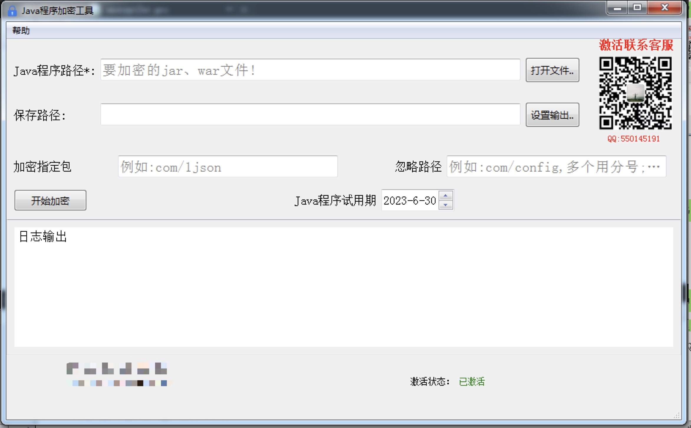

# JavaCodeEncryptor
Java代码加密工具,Java程序加密,Java一键加密工具

 支持Springboot 项目代码加密，对你的代码进行加密，市面工具无法实现反编译。加密 Class 文件中每个方法的 Java 字节码，运行时在 JVM实现动态解密。

| 支持的部署环境 | Windows/Linux/macOS                     |
| -------------- | --------------------------------------- |
| 支持的框架     | SpringMVC、SpringBoot、Maven            |
| 场景           | java加固，开发jar\war包给第三方进行交付 |
| Jar试用期      | 支持设定Jar文件有效期                   |
| 加密范围       | 支持选择性加密                          |

  无需修改原项目代码，只要把编译好的jar/war包用本工具加密即可。

下载：

 [Windows版本（点击下载）](https://www.1json.com/res/encryJarTool-0617.zip)

  [Mac版本  (点击下载)](https://www.1json.com/res/encryptTool_mac.dmg)

Windows:

有问题联系qq：**550145191**
